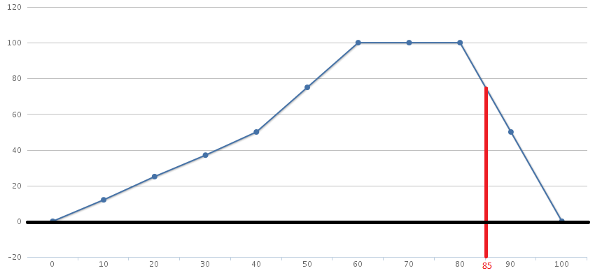

# membershape 

## install
`npm i membershape`

## use
```javascript
var mShape = require('membershape').mShape

var val = mShape(85, [0,40,60,80,90,100])

console.log(val) // 75
```



## function: mShape
`mShape(value, shape, [scale])`

### value
`Number: value to test`

### shape
`Array: shape`

### scale
*OPTIONAL* `Number: scale of shape, default is 100`
